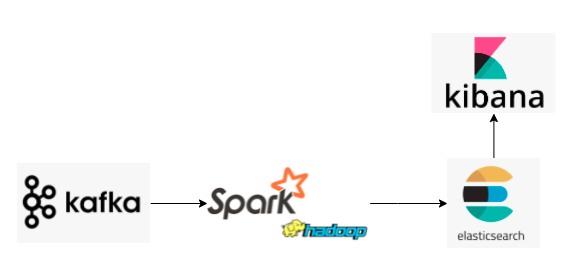
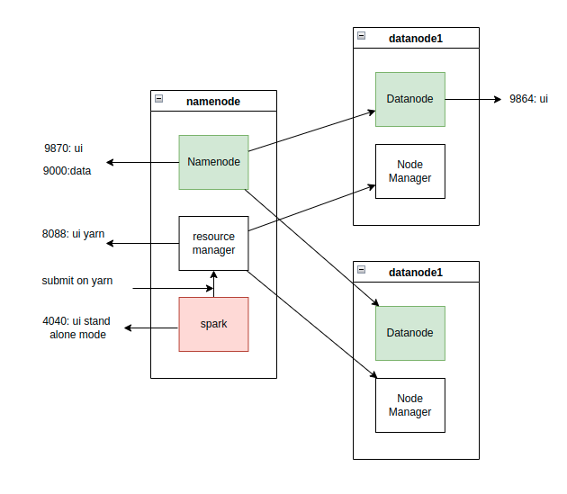
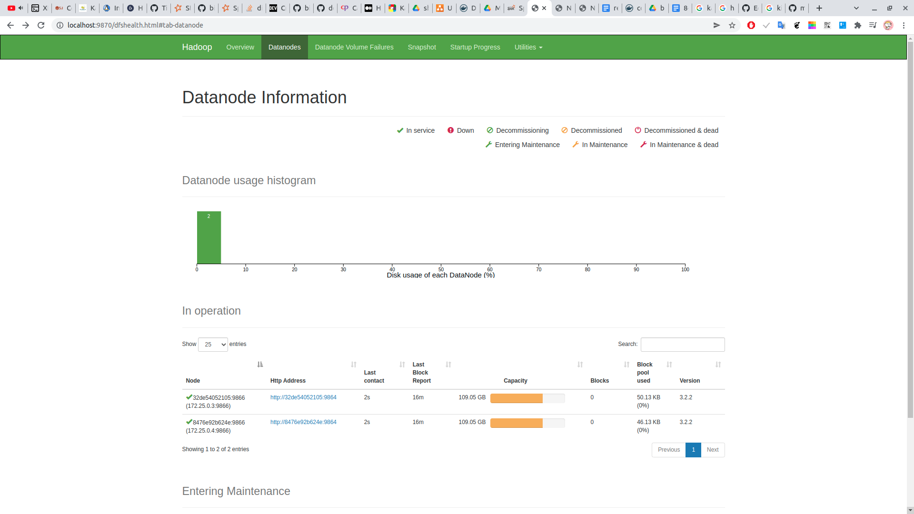
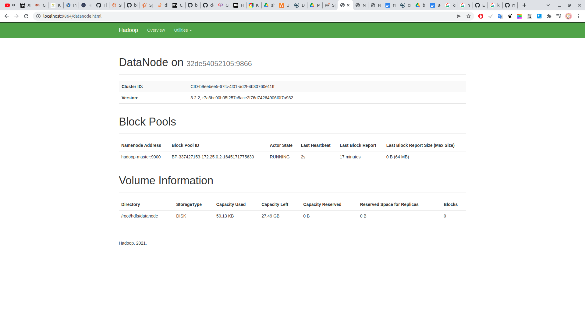
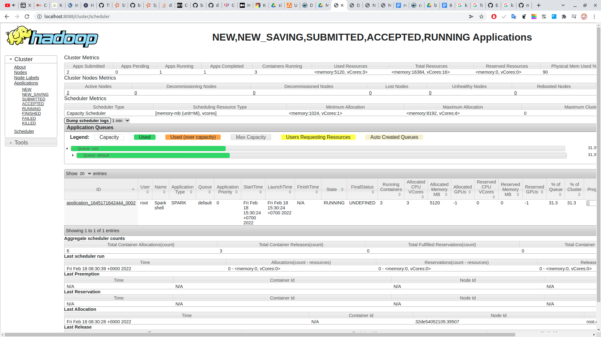

# shopee-analysis
bigdata flow example


# Kafka 
- kafka với single node

| name | option |
|-------|-------|
|KAFKA_LISTENER_SECURITY_PROTOCOL_MAP |INTERNAL, EXTERNAL_SAME_HOST, PLAINTEXT  *(no auth) 
|KAFKA_LISTENERS |```<protocol>://<host>:<port> ``` EXTERNAL_SAME_HOST://:29092, EXTERNAL_DIFFERENT_HOST://:29093, INTERNAL://:9092|
|KAFKA_ADVERTISED_LISTENERS|cái trên chỉ là cho broker thôi . muốn client(consummer, producer) kết nối được thì phai chỉ định cái này INTERNAL://kafka:9092, EXTERNAL_SAME_HOST://localhost:29092, EXTERNAL_DIFFERENT_HOST://157.245.80.232:29093|


# Spark on Hadoop 


- sau khi compose up thì cần vô master bật hadoop
```
docker exec -it hadoop-master bash    
hadoop namenode -format
start-all.sh  
```

- check jps trên master 
```
root@47116eadca50:/# jps
1747 NameNode
2729 Jps
793 SecondaryNameNode
1067 ResourceManager

```
- check jps trên worker 
```
root@32de54052105:~# jps
471 Jps
236 NodeManager
111 DataNode
```

- check ui namenode tại : ```http://localhost:9870/```


- check ui data node tại: ```http://localhost:9864/```


- chạy thử một job spark rồi check ui yarn ```http://localhost:8088/cluster/scheduler```

```
docker exec -it hadoop-master bash 
spark-shell --master yarn 
```
- yarn: 



# Flow 

## 1. Crawl

## 2. Chạy producer gửi massage vô kafka 
- trong prj chạy lệnh class 
```com/team/job/create/CreateStream.java```

- test thử 
```com/team/job/eval/TestReadKafka.java```
## 3. Dùng SparkStreaming đọc và đẩy vô HDFS 

### standalone

- chấp nhận là 1 thâng spark master sẽ không thể init được executer 
- nếu muốn chạy stand alone mode, chỉ cần trỏ spark folder. trong đó cấu hình file worker. vô sbin chạy start-all.sh. check jps tiến trình Worker và Master. chắc là trc đó vẫn cần ssh. 

- với stand alone, check job ở http://localhost:8080/
``` bash
#
spark-submit --master spark://spark-master-host:7077 --total-executor-cores 4 --class com.team.job.process.PushHDFS /opt/bitnami/spark/examples/jars/shopee-streaming-1.0-SNAPSHOT-jar-with-dependencies.jar
#
start-slave.sh spark://localhost:7077 
#
spark-shell --packages org.apache.spark:spark-sql-kafka-0-10_2.12:3.2.0 --master local 
```
``` scala 
val df = spark.readStream.format("kafka").option("kafka.bootstrap.servers", "172.25.0.8:9092").option("subscribe", "hello-kafka").option("startingOffsets", "earliest").load()
val query2 = df.writeStream.format("console").start()
```

### yarn mode
- yarn mode để đọc thử streaming. nhớ chỉnh version kafka cho đúng với spark 
```
spark-shell --packages org.apache.spark:spark-sql-kafka-0-10_2.12:3.1.2 --master yarn --conf spark.sql.parquet.binaryAsString=true --num-executors 3  --executor-memory 1G
```

- submit to hdfs 
```
spark-submit --master yarn --num-executors 3  --executor-memory 1G --class com.team.job.process.PushHDFS shopee-streaming-1.0-SNAPSHOT-jar-with-dependencies.jar
```
- check hdfs
```bash
spark-shell --master yarn --conf spark.sql.parquet.binaryAsString=true --num-executors 3  --executor-memory 1G 
#
val df = spark.read.parquet("hdfs://hadoop-master:9000/test")
df.show()

```

## 4. Đọc từ HDFS đẩy vô ES 


# REF 
- https://spark.apache.org/docs/latest/structured-streaming-kafka-integration.html#deploying
- 